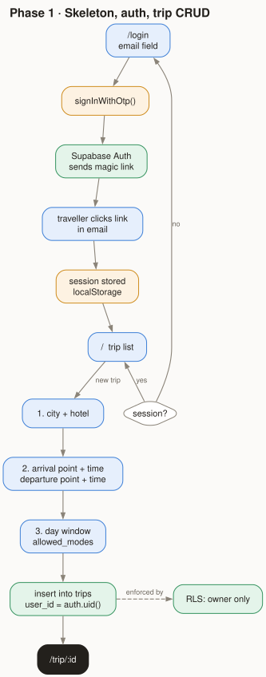
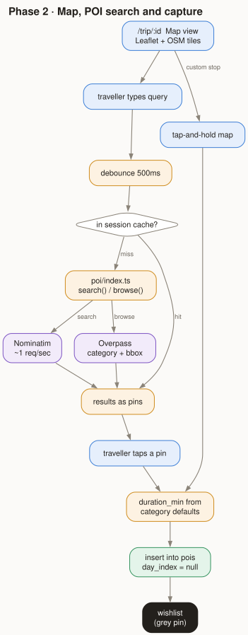
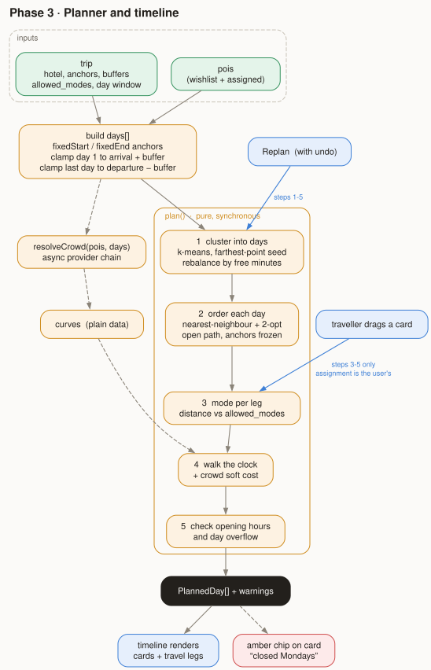
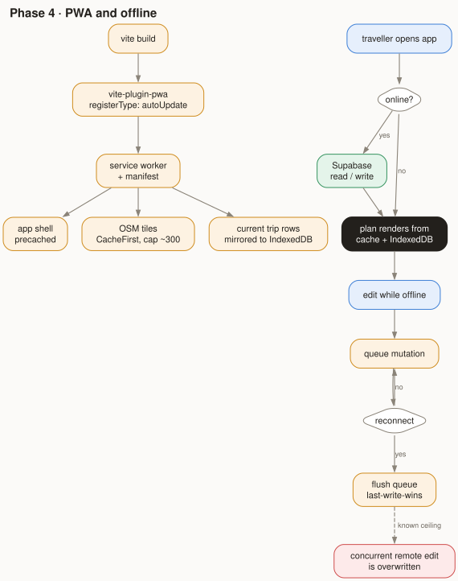
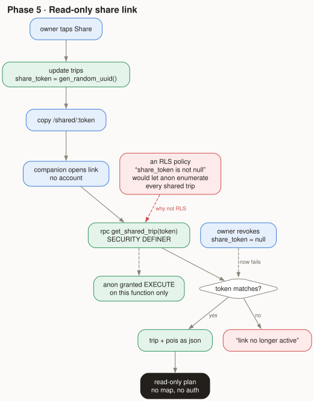
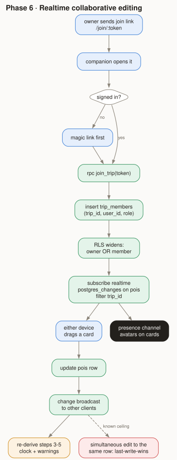
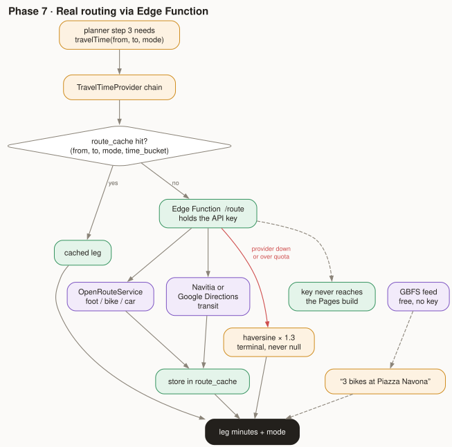
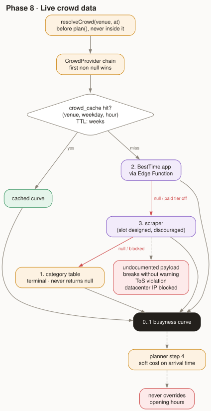

# Phase flow diagrams

One diagram per build phase from the
[design spec](../superpowers/specs/2026-09-20-travelmate-design.md).

Sources are in `src/*.dot`. Regenerate after editing:

```sh
cd docs/diagrams
for f in src/phase*.dot; do dot -Tsvg "$f" -o "$(basename "$f" .dot).svg"; done
```

## Legend

| Colour | Meaning |
| --- | --- |
| blue | traveller action |
| amber | client-side logic (runs in the browser) |
| green | Supabase — Postgres, Auth, Realtime, Edge Functions |
| purple | third-party service |
| red | failure path, or a known ceiling written down on purpose |
| black | the phase's output |

Diamonds are decisions. Dashed edges are "informs" or "enforced by" rather than
control flow.

Diagrams use a light background rather than a transparent one, so they stay
legible in GitHub's dark theme.

## Phases 1-5 — the complete product

### Phase 1 · Skeleton, auth, trip CRUD


### Phase 2 · Map, POI search and capture


### Phase 3 · Planner and timeline
The phase where this stops being a list app. Note the two entry points into
`plan()`: Replan runs steps 1-5, a drag runs only steps 3-5, because the drag
*is* the assignment decision and re-clustering would undo it.



### Phase 4 · PWA and offline


### Phase 5 · Read-only share link
The red node records why this is an RPC and not an RLS policy: a
`share_token is not null` policy would let any anonymous client enumerate every
shared trip in the database.



## Phases 6-8 — each droppable

### Phase 6 · Realtime collaborative editing


### Phase 7 · Real routing via Edge Function
Every provider path falls through to haversine, which is terminal and never
returns null. Third-party keys live in the Edge Function, never in the Pages
build.



### Phase 8 · Live crowd data
Same chain shape as phase 7. The category table sits at the bottom permanently —
it is the fallback, not a placeholder to be replaced.


